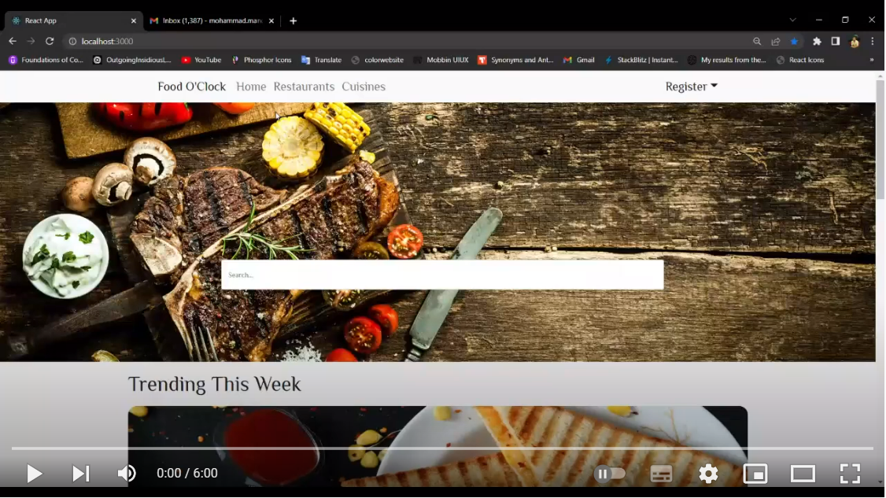

## Table of contents
- [Overview](#overview)
- [Technology used](#technologies-used)
- [Demo](#demo)
- [Getting Started](#getting-started)
    - [prerequisite](#prerequisite)
    - [installation](#installation)
- [References](#references)

___

## Overview
Restaueants reservation and review web app that does the following :
<br>
- Browse, search, and filter all available restaurants.
- Submit restaurant reservations.
- Approval workflow for restaurant's reviews and reservations.
- Admin Panel to control and perform CRUD operations on the website's data and workflows.

___


## Technologies used

### Backend
- Laravel 9.0
- MySql

### Frontend
- React JS
- BootStrap 
____

## Demo

[](https://www.youtube.com/embed/-FXB9iVEqmQ)

___

## Getting Started

- ### Prerequisite 
    - WampServer / Xampp 
    - PHP 7.2.5 or newer
    - composer installed
    - MySQL 5.5 or newer installed with database created
        - create database called "foodOclockdb"
    - Node JS v-14 or newer
    - Source-Code Editor  such as ( VS Code ... )
    - git should be installed
- ### Installation
    1. Go to directory you want to download in
        - git clone https://github.com/Mohammad-Mancy/food-oclock.git
    2. Open project folder ``` food-oclock ``` and configure laravel backend
    ```
    cd backend-laravel 
    composer install
    php artisan migrate

    php artisan db:seed
    php artisan serve
     ```
    3. Now install node modules and run the react app 

    ```
    cd ../frontend-react
    npm install -g node-modules
    npm start
    ```

___

## References
- [LinkedIn](https://www.linkedin.com/in/mohammad-mancy-75b591227/)
- [Twitter](https://twitter.com/mancy_mohammad)
- [Facebook](https://www.facebook.com/mohammad.mancy.33)
